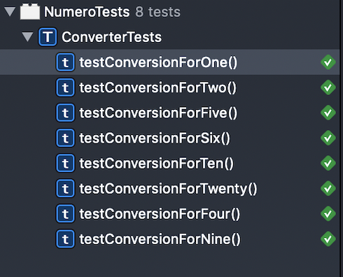

# TestDrivenDevelopmentExample

### Test Driven Development Example (TDD)

###### Test Driven Development (TDD) is a popular way to write software. The methodology dictates that you write tests before writing supporting code. While this may seem backward, it has some nice benefits.

---

###### One such benefit is that the tests provide documentation about how a developer expects the app to behave. This documentation stays current because test cases are updated alongside the code, which is great for developers who aren’t great at creating or maintaining documentation.

---

